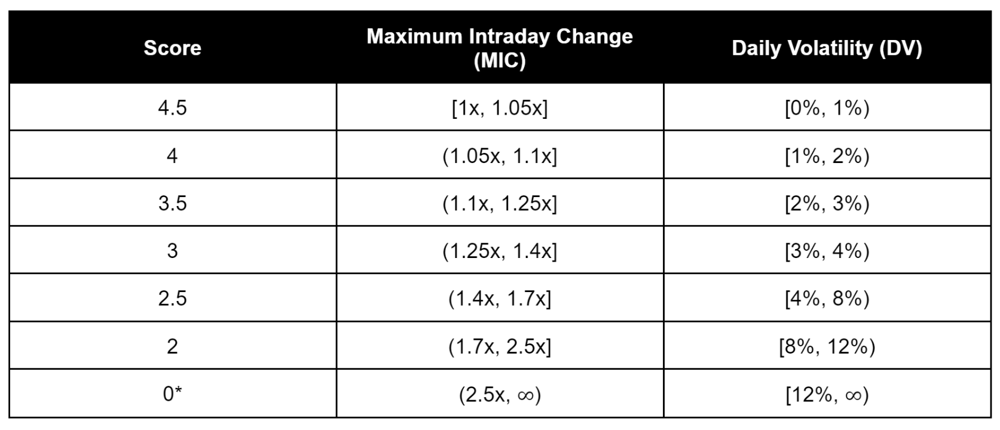
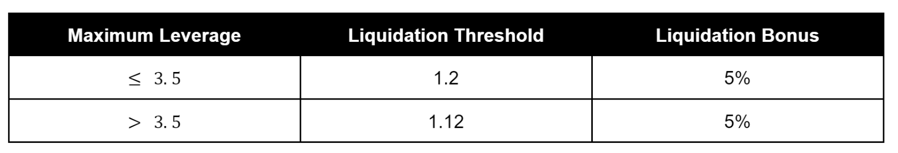

# The Credit Line Extension Risk Framework

Contract-to-contract (C2C) lending will be one of Mars key features and differentiators. C2C lending, as its name indicates, refers to lending activity that happens between Mars and other smart contracts (thus contract-to-contract), as opposed to between Mars and individual users. From the point of view of other protocols, C2C lending will be a powerful tool that could allow them to innovate on top of Mars by tapping into its liquidity. For Mars, on the other hand, these protocols will effectively represent a new source of demand for the protocol, making its money markets more attractive for depositors and the whole protocol more useful.
Naturally, C2C lending also poses additional risks for Mars. These risks stem from a number of different sources, from the particular use case given to the borrowed assets to the technical and centralization risks associated with the smart contract (SC) borrowing the assets. In this sense, one of the most important goals when designing Mars C2C lending capabilities was to develop a robust and conservative architecture that would maximize the safety of user funds.
One of the tools intended for this purpose is the C2C lending risk framework, which aims to mitigate the risks involved in this process by standardizing the way in which those risks are measured and providing a conservative and thorough methodology for determining:
Content on this page should be migrated to GitHub with the title Credit Line Extension Risk Framework: 

1. Whether a given SC[^1] should be extended a loan. 
2. The specific risk parameters associated with that loan.

    [^1]: This framework will specifically focus on SCs requesting loans to deploy them in leveraged yield farming strategies, but could be expanded eventually to incorporate other use cases.

Throughout this post, this framework will be explored in detail. In the first section, a high-level overview of the new SC loan assessment process will be presented. The next two sections will cover the minimum requirements a new smart contract needs to meet to be considered safe under the risk framework. Lastly, the final sections cover the risk parameters definition methodology.
The overall purpose of the post is to lay the groundwork for a proposal to Mars governance that the framework be adopted as a minimum safety standard for assessing eligibility of new smart contracts to be extended loans. Note: since no person or centralized group controls Mars, it will be up to the Mars community to adopt and enforce this minimum safety standard.

## SC Loan Assessment Process

For a new SC to be extended a loan it should meet a minimum set of requirements at three different levels:

1. The SC requesting the loan itself (from here on the Base SC). This first filter is intended to guarantee a minimum level of quality and safety of the Base SC. 
2. Other SCs (or protocols) the Base SC interacts with. This filter is intended to mitigate the risk of extending loans to SCs that interact with vulnerable or risky protocols. 
3. The assets the SC interacts with. For leveraged yield farming (which is the focus of this framework), these assets refer to the pair of assets used to provide liquidity and yield farm. The objective of this third filter is to reduce the risk of exposing Mars funds to low quality assets.

Mars governance can decide whether to conduct the above process on a case-by-case basis or to whitelist protocols and/or assets to speed up the process going forward. The whitelisting process would require a formal governance vote in which it is decided that a certain protocol or asset that has already met the requirements doesn’t need to be reviewed each time a new loan is requested (this could make sense, for instance, for protocols or assets where several leveraged yield farming strategies have been or are expected to be deployed).
Now, only when an application passes the above filters should governance proceed to establish the specific risk parameters for the leveraged yield farming strategy.

## Base SC Assessment

The first filter a new SC must pass in order to be extended a loan under this framework relates to the safety and quality of the SC itself (the Base SC). This safety will be measured through the risks associated with that SC. Specifically, it will need to meet the following set of minimum requirements:

### Technical quality:
* Audited by a reputable firm. 
* High quality code: 
  * Written with best practices or using battle-tested code. 
  * Adequate, thorough documentation. 
  * High quality tests, including unit tests and integration tests. 
* Significant bug bounty for a minimum of 2 weeks. 
  * On testnet: Minimum $1M for critical bugs. 
  * On mainnet: Minimum $3M for critical bugs.

### Trust minimization:
* The SC is immutable or, in case it’s not, any changes or upgrades to the SC that are made after the SC is approved for Mars C2C lending need to be approved by Mars governance (whether through a full token holder vote or a multisig committee approved for this purpose). 
* The SC is always in control of the borrowed assets. 
* The oracle used for the leveraged yield farming strategy is decentralized and robust. 
  * If the oracle used is a TWAP, the specific implementation should be that of the Mars TWAP Oracle. 
* The specific implementation of each strategy needs to adhere to the risk parameters covered in this framework.

## Other SCs and Assets Assessment

The other SCs and assets assessment will follow a similar methodology as the process for assessing the Base SC. Specifically, each of the other SCs and the protocols associated with each asset a strategy employs will need to meet the following minimum safety criteria:

### Technical quality:
* Audited by a reputable firm. 
* High quality code: 
  * Written with best practices or using battle tested code. 
  * Adequate, thorough documentation. 
  * High quality tests, including unit tests and integration tests. 
* SCs interacting with the Base SC should be singleton: there's a specific instance of the SC that is already deployed on mainnet that is clearly identifiable.

### Trust minimization: 
A SC or protocol may meet the minimum requirements through any of the following two combinations:

* The SCs are immutable or are controlled by a DAO with safe processes in place. 
* There’s still some centralization around the key SCs, but the team behind the project is excellent all around (with strong technical and crypto expertise) and there’s a plan for progressively decentralizing the protocol. Additionally, in this case there should also be a timelock of at least 48 hours (preferably more) before any changes are made effective in the protocol.

Note that market risk will not be part of this initial assets filter. This is intentional, though, as market risk will be the main input for the risk parameters definition methodology, which will be explored in the following sections.

## Example 1: SC and Assets Assessment

This example is intended to help the reader differentiate between the protocols a given strategy interacts with and the assets it employs.
Let a new SC (from Protocol X) be requesting a C2C loan from Mars.
The loan will be used by Protocol X to deploy a leveraged yield farming strategy for mETH/UST on top of Mirror.
Now, the first step would be the SC assessment, which would include the SC requesting the loan (from Protocol X), as well as the SCs the strategy interacts with. In this case those SCs would be the pool contract from Astroport (mETH/UST) and the staking contract from Mirror (where the LP shares are deposited to receive MIR rewards).
The assets the strategy employs, on the other hand, would be mETH and UST, which would need to meet the aforementioned minimum criteria for the strategy to move on to the risk parameters definition phase.

### Risk Parameters

Before defining the risk parameters methodology, it’s worth exploring what the risk parameters are:

**Health Factor**: Determines the safety of a user’s leveraged yield farming position. The higher the Health Factor, the safer a position is and vice versa. A Health Factor below 1 indicates that the position is effectively bankrupt (value of assets < value of debt). The Health Factor for a given position i is calculated as follows:

where value of assets includes all assets held by the position. For example, for leveraged yield farming strategies on top of Mirror, these assets will be denominated in LP shares of the given pool the strategy is deploying assets to.

**Maximum Leverage**: Indicates the maximum amount of debt a user can take when opening or adjusting a position given the user’s deposited collateral. The Initial Leverage of a position must always be less than or equal to the Maximum Leverage for the strategy. For example, a Maximum Leverage of 3 indicates that a user who provides 100 UST worth of assets as collateral can borrow up to 200 UST worth of assets for that strategy. The Initial Leverage of a given position i (before the assets are deployed to the strategy) can be calculated as follows:

**Liquidation Threshold**: Determines the level at which a position is considered to be undercollateralized and can be liquidated. For example, a Liquidation Threshold of 1.1 indicates that when the Health Factor of a position within the given strategy drops below 1.1, the position can be liquidated. The Liquidation Threshold will always be above 1 (to avoid bankrupt positions) and below the initial Health Factor at Maximum Leverage (which serves as a margin of safety for users that employ Maximum Leverage).

**Liquidation Bonus**: Determines the bonus the liquidator receives when it liquidates a position. This bonus is paid from the collateral of the user that gets liquidated.

**Maximum Cap per Strategy**: Indicates the maximum amount of assets Mars will be able to deploy to a given strategy. If multiple SCs are deploying the same strategy, the Maximum Size will need to be divided between those SCs. In addition to an overall maximum cap per strategy, Mars will be able to determine a maximum cap per protocol implementing that strategy on an ad hoc basis.

**Minimum Position Size**: Indicates the minimum size a new position needs to have in order to be opened. For a given position i, its size is defined as:

**TWAP Oracle Parameters**[^2] (only applicable if the strategy is using a TWAP oracle): 
* Window of the TWAP: Indicates the minimum period of time that needs to pass for a new price to be considered for the TWAP calculation. 
* Minimum size of the liquidity pool: Indicates the minimum liquidity a pool needs to have for an oracle using that pool to be accepted for a given strategy.
*Research is currently being undertaken to establish these parameters in a rigorous manner. Thus, the methodology for establishing these parameters will not be provided within this framework but rather in a future research report.
    [^2]:Research is currently being undertaken to establish these parameters in a rigorous manner. Thus, the methodology for establishing these parameters will not be provided within this framework but rather in a future research report.

### Maximum Leverage, Liquidation Threshold and Liquidation Bonus

The Maximum Leverage will be defined based on three metrics: the maximum intraday drawdown, the maximum intraday increase and and the daily volatility of the assets that are part of the strategy. For each asset pair, these variables will be calculated as follows:

* The maximum intraday change (MIC) will be measured as the maximum price change (from high to low) in a trading day over the last 365 days. 

* The daily volatility (DV) will be measured as the standard deviation of the logarithmic daily returns of the base asset in terms of the quote asset for a given period of time. Specifically, the daily volatility will be calculated for the previous 30, 60 and 90 days. The maximum of these 3 values will be the chosen metric for determining the maximum leverage.

## Example 2: Maximum intraday change
For a bLUNA/LUNA leveraged yield farming strategy the base asset will be bLUNA and the quote asset LUNA. The intraday change during a given day will be calculated as a multiple as follows:

To give a numerical example:

To calculate the maximum intraday change (MIC), the above calculation is done for each day during the last 365 days and the maximum value is selected as the MIC.

Now, each strategy will be scored based on the above metrics as follows:

_* Strategies with a score of 0 in any of the above categories won’t be able to receive leverage._
Then, based on the above score the maximum leverage will be determined as follows:

Having defined the maximum leverage, the liquidation threshold and liquidation bonus will be determined as follows:

The liquidation bonus should be understood in the context of the liquidation process, which should work as follows:

1. When a position’s health factor falls below the liquidation threshold, the position can be liquidated by any user. 
2. When a liquidator liquidates a position, the following happens: 
    * The liquidator provides the necessary assets to repay the debt (or a portion of it). 
    * For performing that service, the liquidator receives LP tokens (from the liquidated strategy) worth the sum of the debt and the liquidation bonus. For example, if a liquidator repays 100 UST of a strategy farming MIR/UST, the liquidator would receive 105 UST (debt + liquidation bonus - in this case 5% liquidation bonus is assumed) worth of MIR/UST LP tokens for performing the liquidation. 
    * The remaining assets (if any) are left in the pool as an open farming position that belongs to the liquidated user.

[https://docs.marsprotocol.io/mars-protocol/protocol/welcome-to-mars/c2c-lending-credit-line-extension-risk-framework](https://docs.marsprotocol.io/mars-protocol/protocol/welcome-to-mars/c2c-lending-credit-line-extension-risk-framework)

Desired destination link: [https://github.com/mars-protocol/mips/Credit-Line-Extension-Risk-Framework.md](https://github.com/mars-protocol/mips/Credit-Line-Extension-MIP-Template.md)