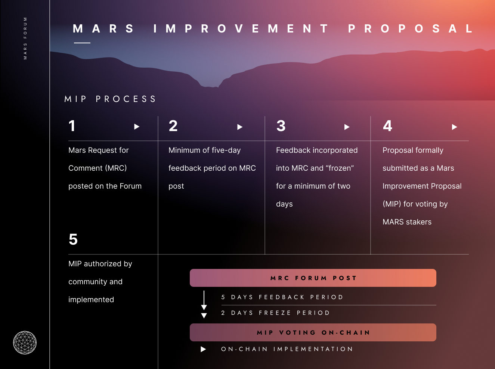

# Mars Improvement Process

## MRC-0: The Mars Improvement Proposal (MIPs) Framework

## References

* Technical MIP Template
* Red Bank Asset Listing MIP Template
* Credit Line Extension MIP Template
* General MIP Template
* The Red Bank Asset Listing Risk Framework
* The Credit Line Extension Risk Framework

## Summary

In this Mars Request for Comment (MRC-0) the authors propose a standardized process for governance proposals related to the Mars Decentralized Credit Protocol (Mars). After gathering feedback and finalizing this proposal, we recommend that all future proposals adhere to this Mars Improvement Proposals (MIPs) Framework.
 
 
The Martian Council is a smart contract governance DAO comprised of all xMARS holders and the original Mars builders who hold smart-contract-locked MARS.[1](about:blank#fn1) Governance proposals are made by a member of the Martian Council to the entire Martian Council. Of course, any person can draft and publish a governance proposal–but it does not become votable unless proposed by a Martian Council member in accordance with the Mars governance protocol (which includes an xMARS deposit requirement–*see below*).
 
Governance proposals may cover any topic related to Mars; however, the exact nature of these proposals–and the consequences of an approval or rejection–will vary depending on the category and topic of the proposal.
 
The Martian Council only has binding governance power over the configurable parameters of specific copies of Mars deployed as smart contracts to Terra (Mars Smart Contracts). The Mars Smart Contracts are directly responsive to the governance decisions of the Martian Council, and therefore are under the Martian Council’s direct control. This includes control of whether, when and how to spend $MARS in the Treasury (initially 10% of $MARS total token supply) and the setting of slippage caps on the Mars Smart Contracts autonomous swaps of assets to UST, governance quorum and approval thresholds, etc.[2](about:blank#fn2)
 
However, the Martian Council can also express its preferences on a broader range of Mars-related topics relating to further development of the Mars Protocol, which future versions or forks of the Mars Protocol should be developed or, once developed, deployed as part of the Mars Smart Contracts, use of the [Mars branding IP](https://mars-protocol.medium.com/package-deployed-releasing-the-mars-brand-into-the-creative-commons-4946bc292bef), cross-chain deployments, Mars website feature changes, etc. Because these dimensions of the Mars community are not under the direct control of the Martian Council, the Martian Council’s governance proposals on these topics should be regarded as signaling the Martian Council’s preferences–i.e. governance proposals on these topics are non-binding.
 
So, there are two main categories of Martian Council governance proposals:

1. **Binding proposals:** Are proposals to make changes to the configurable aspects of the Mars Smart Contracts; because the Martian Council controls these smart contracts, the Martian Council’s vote is both necessary and sufficient to approve these changes.
2. **Signaling proposals:** Are all other governance proposals made to the Martian Council–for example, signaling a preference for certain code or functions to be added to Mars or the marsprotocol.io website. Signaling proposals (including this proposal) are voted upon on-chain in the same way as binding proposals. However, because these proposals require off-chain implementation actions by extrinsic parties–such as a website operator, a smart contract developer, or others–the Martian Council’s approval is neither necessary nor sufficient to cause these proposals to be implemented. Therefore, these proposals merely *signal* the Martian Council’s support for or opposition to the proposed outcome.

We foresee four main governance proposal topic categories:
 
1. **Technical Proposals:** Certain proposals for changes to certain configurable aspects of the Mars Smart Contracts (binding), which can be modified directly by on-chain votes, or code changes to the Mars Protocol (signaling), which require upgrading the protocol.
2. **Red Bank Asset Listing Proposals:** Proposals to add or remove support for one or more assets within the Red Bank (typically binding).
3. **Credit Line Extension Proposals:** Proposals from developers aiming to secure a virtual “credit line” from the Red Bank for unique applications such as leveraged yield farming (binding or non-binding, depending on whether code is ready and deployed on chain at time of proposal).
4. **General Proposals:** All other proposals impacting areas such as the treasury, governance, and tokenomics (mix of binding and non-binding).

All proposals should follow the following steps:
 
1. Post a Mars Request for Comment (MRC) on the [Mars Protocol Forum](https://forum.marsprotocol.io/). Note that formal requests for comment should follow the naming convention proposed here: *MRC-#: [Title of MRC].* Submitters should replace the “#” with the number of the MRC based on the order in which it was submitted and the title should match the content of the request.
2. Submit a formalized Mars Improvement Proposal (MIP) that adheres to the specifications below for on-chain voting.
3. If approved, the MIP will be implemented (binding MIPs) or may be implemented (signaling MIPs). Implementation of binding MIPs depends only on Terra validators following the Terra protocol. Implementation of signaling MIPs depends upon many factors, including the willingness and availability of off-chain actors to perform the work needed to implement the MIP.

The following timeline shows the proposed flow for protocol modifications:
 
 

 
**Abstract**
 
MRC-0 defines the *Mars Improvement Proposals (MIPs) Framework* for all subsequent MIPs to utilize. This MIP is the foundational MIP that provides the necessary templates, processes, and guidelines for working within the framework and defines the key roles required for the operation of the MIPs Process.

## Motivation

For Mars to successfully operate as a fully decentralized and self-sustainable DAO, a formalized process of decision-making is required. In a permissionless protocol, everyone should be able to propose changes and improvements.
 
 
The MIP Framework serves to empower each Martian Council participant by giving them a standardized way of interacting with the wider DAO and defining its future shape.

## Specification

### MIP0: Definitions of the Mars Improvement Proposal Framework

* Mars Improvement Proposals (MIPs): MIPs are standardized proposals to the Martian Council to change the parameter values of the Mars Smart Contracts or signal support for certain off-chain initiatives (such as further development of the Mars Protocol code). MIPs can be added, amended, replaced, and removed.
* MIP Types: MIPs can be one of four types: Technical proposals that impact smart contract code, Red Bank asset listing proposals, credit line extension proposals or general proposals. General MIPs are sub-categorized as treasury, UI, governance, and tokenomics.
* Minimum Feedback Period: The minimum amount of time within which the community can give feedback in response to a proposed MRC before it can advance to an on-chain vote (MIP).
* Minimum Frozen Period: The minimum amount of time during which an MRC must remain unchanged before it can advance to an on-chain vote as a MIP.
* MIP Editor(s): MIP Editors enforce the administrative and editorial aspects of the overall MIPs process. ***Note:** MIP Editors’ approval is not required for a proposal to be valid–running MIPs past the editors is merely suggested as a good practice for having consistent, high-quality, community-recognized proposals.*

### MIP0: Core Principles

1. Specificity: A MIP must define and address a specific behavior or single responsibility.
2. Completeness: A MIP must be thorough. Relevant, specific particulars must not be left undefined or unreferenced.
3. Avoid overlap: Multiple MIPs must not implement the same type of behavior independently. For instance, there should not be two separate, interchangeable ways to integrate new apps in the Fields of Mars.
4. Clarity: A MIP must not have equally valid conflicting interpretations. A MIP must be as clear and easy to understand as possible.
5. Brevity: A MIP must be as short as possible, including only what is essential given the other core principles.

### MIP Proposal Type Categories

There are two main categories of Martian Council governance proposals:

1. **Binding proposals:** Are proposals to make changes to the configurable aspects of the Mars Smart Contracts; because the Martian Council controls these smart contracts, the Martian Council’s vote is both necessary and sufficient to approve these changes.
2. **Signaling proposals:** Are all other governance proposals made to the Martian Council–for example, signaling a preference for certain code or functions to be added to Mars or the marsprotocol.io website. Signaling proposals (including this proposal) are voted upon on-chain in the same way as binding proposals. However, because these proposals require off-chain implementation actions by extrinsic parties–such as a website operator, a smart contract developer, or others–the Martian Council’s approval is neither necessary nor sufficient to cause these proposals to be implemented. Therefore, these proposals merely *signal* the Martian Council’s support for or opposition to the proposed outcome.

### MIP Topic Categories Categories

There are four potential categories for MIPs:

* Technical MIPs
* Red Bank Asset Listing MIPs
* Credit Line Extension MIPs
* General MIPs

Each category has specific considerations and requirements as detailed below.
 
 
**Technical MIPs**
 
Certain proposals for changes to certain configurable aspects of the Mars Smart Contracts (binding), which can be modified directly by on-chain votes, or code changes to the Mars Protocol (signaling), which require upgrading the protocol. Technical MIPs should be formatted per the Technical MIP Template.
 
**Red Bank Asset Listing MIPs**
 
Proposals to add support for one or more new assets within the Red Bank. Proposals should meet the specifications in the [Red Bank Asset Listing Risk Framework](https://docs.marsprotocol.io/mars-protocol/protocol/welcome-to-mars/red-bank-risk-framework) and adhere to the [New Red Bank Asset Listing Governance Process](https://docs.marsprotocol.io/mars-protocol/protocol/welcome-to-mars/new-red-bank-asset-listing-governance-process).
 
**Credit Line Extension MIPs**
 
Proposals from developers aiming to secure a virtual “credit line” from the Red Bank for unique applications such as leveraged yield farming. Proposals should meet the specifications of the [C2C Lending Credit Line Extension Risk Framework](https://docs.marsprotocol.io/mars-protocol/protocol/welcome-to-mars/c2c-lending-credit-line-extension-risk-framework) and adhere to the [New Credit Line Extension Governance Process](https://docs.marsprotocol.io/mars-protocol/protocol/welcome-to-mars/new-credit-line-extension-governance-process).

**General MIPs**
 
A general category for proposals that do not fall under the above categories. General proposals can be sub-categorized in accordance with their various topics and should be formatted per the General MIP Template.

## MIP0: The MIP Lifecycle

### MIP Lifecycle Breakdown

1. Conception: A MIP Author posts a MRC proposal on the [Mars Protocol forum](https://forum.marsprotocol.io/) under the appropriate category. From this point on, MIP Editors will be available to assist the MIP Author.
2. Approved by MIP Editor(s): A MIP Editor verifies that the posted MRC proposal:
* Follows the appropriate format of the MIP Template for its type.
* Is either an original MIP or a replacement for an older MIP.
* Has been submitted to the [MIP GitHub](https://github.com/mars-protocol/mips) repository with a Pull Request by either the MIP Author or a MIP Editor.
1. If the verification is successful, the MIP Editor:
    * Approves the MIP and assigns it a formal MIP number.
    * Merges in the PR.
    * Mars Request for Comments (MRC): A period of reviewing by the community and attendant redrafting begins. The minimum duration of this period is determined by two variables:
        * Feedback Period: 5days.
        * Frozen Period: 2 days.

Please note that in the case of UI MRCs, there is no need for a Frozen Period.

1. Fulfilled Feedback Period Requirements: After the MIP has fulfilled the MRC phase, it is ready for on-chain submission.
2. On-Chain Submission: At this point, the MIP Author has two options: submit an on-chain MIP vote referencing the associated MRC and then notify the Mars community on the forum or request help from a MIP Editor to submit the on-chain vote. Proposals can also be submitted through the UI at marsprotocol.io.
3. Accepted/Rejected: The MIP is voted on. If it passes, it is officially accepted and is given the Accepted status. If not, the MIP is rejected.

### On-Chain Submission

> In order to submit a MIP on-chain, the MIP submitter must call the submit_proposal function from the Martian Council contract. This can by interacting directly with smart contracts or by using the UI at marsprotocol.io and specifying the following parameters:
 
* `sender` which is the address of the proposal submitter
* `deposit_amount` which is the amount of MARS that must be locked in the Martian Council contract until the proposal expires (100,000 MARS at the time of this writing), is rejected or is approved by Martian Council voters. In case the proposal is rejected, the deposited MARS will be distributed to xMARS holders
* `title` which is the title of the MIP. It must start with "MIP-" and the number of the MIP which was assigned by a MIP Editor. The MIP title must be 64 characters long or less
* `description` which is a condensed description of the MIP, taken from the submitted (and associated) MRC on the community forum. The `description` must be maximum 1024 characters long
*`link` which is a link to the associated MRC posted on the community forum. The `link` must be `128` characters long or less
* `messages` which is the MIP payload that defines which contracts and parameters the MIP is meant to change

### Resubmission

A MIP can be resubmitted for an on-chain vote up to 3 times without having to go through phases 1-4 again if it failed to pass due to legitimate external reasons (e.g., potential low governance participation that did not meet the minimum on-chain quorum)

### **Other MIP Statuses**

- Withdrawn: Assigned when an MIP Author withdraws their MIP proposal.
A MIP may be withdrawn at any point before it enters an on-chain vote. Note that a withdrawn proposal can be taken over from the original Author with a simple transition facilitated by a MIP Editor and the respective parties. If the original MIP Author ceases to be available, a MIP Editor may proceed with the transfer of authorship.
- Deferred: Assigned when a proposal has been deemed as not ready or not a priority but can be re-proposed at a later date. This status can be assigned during MRC or by a rejecting forum poll.
- Obsolete: Assigned when:
    - A MIP has been superseded or deprecated.
    - A MIP has been deferred for over six months.
    - A MIP Author has abandoned the proposal and no person has communicated willingness to take over the responsibility of an MIP Author.

### **MIP Status Change Process**

> If a MIP Author requests a status change for a MIP, a MIP Editor will review it. If the status change is warranted, the MIP Editor will change the status. Otherwise, the MIP Editor will revert and highlight issues for the MIP Author to fix before requesting another status change.

### MIP0: MIP Replacement Process

A MIP can define one or more replacement targets in its preamble. If the MIP is given the Accepted status, the replacement target(s) MIPs receive the Obsolete status and effectively become inactive. The replaced MIP will record the number of the MIP that replaced it. MIPs that depend on the replaced MIP will instead interact with the new MIP.
 
Since dependencies carry over, a MIP with defined replacement target must strictly adhere to dependency requirements and interface correctly with MIPs that depend on the replaced MIP.

### MIP0: Supporting Materials

MIPs can optionally refer to external materials. External materials must be added to the MIPs GitHub in the same folder as the MIP which references them.
 
 
Externally referenced materials are not MIP content and are not ratified when a MIP becomes Accepted unless it is explicitly stated otherwise in an MIP Component specification.

### MIP0: MIP Templates

### Technical MIP Template

The [Technical MIP Template](https://github.com/mars-protocol/mips/General-MIP-Template.md) should be used for MIPs for changes to certain configurable aspects of the Mars Smart Contracts (binding), which can be modified directly by on-chain votes, or code changes to the Mars Protocol (signaling), which require upgrading the protocol.

### Red Bank Asset Listing MIP Template

* The [Red Bank Asset Listing MIP Template](https://github.com/mars-protocol/mips/Red-Bank-Asset-Listing-MIP-Template.md) should be used for MIPs when proposing support for a new asset that’s not currently supported by the Red Bank.
* All Red Bank Asset Listing MIPs should meet the specifications of the [Red Bank Asset Listing Risk Framework](https://github.com/mars-protocol/mips/Red-Bank-Asset-Listing-Framework.md).

### Credit Line Extension MIP Template

* The Credit Line Extension MIP Template should be used for MIPs when proposing the extension of a credit line for a specific set of smart contracts.
* All Credit Line Extension MIPs should meet the specifications of the [Credit Line Extension Risk Framework](https://github.com/mars-protocol/mips/Credit-Line-Extension-Risk-Framework.md).
* The [Credit Line Extension MIP Template](https://github.com/mars-protocol/mips/Credit-Line-Extension-MIP-Template.md).

### General MIP Template

* The [General MIP Template](https://github.com/mars-protocol/mips/General-MIP-Template.md) should be used for MIPs whenever a more specific template is not more appropriate.

### MIP0: MIP Editors

The MIP Framework depends on MIP Editors.

### MIP Editor

MIP Editors enforce the administrative and editorial aspects of the overall MIPs process and program.

### Specific authority of the MIP Editor(s) in MIP0 processes

* MIP Editors control phase 2 of the MIP lifecycle and can assign MIP numbers.
* MIP Editors are admins on the [MIPs GitHub repository](https://github.com/mars-protocol/mips).
* MIP Editors moderate the relevant MRCs categories in the forum.
* MIP Editors are responsible for updating the status of MIPs.

### Editor Responsibilities

A MIP Editor’s responsibilities include:
 
* Providing feedback in the MIP sections of the [Mars Forum](https://forum.marsprotocol.io/).
* Assign formal number labels to MIPs.
* Make sure that titles, MIP statuses, category placements all track the actual MIPs.
* Confirm there is a (real) dedicated MIP author, coordinator, funder and/or sponsor, etc.
* Correspond with MIP authors/coordinators.
* Review MIPs for obvious defects in the language.
* Make sure that MIPs follow the style guide (template).
* Work and communicate with MIP authors to help them submit an MRC for on-chain voting as a MIP.

MIP Editors can correct issues themselves, but they are not required to.
 

## Governance Action

Feedback for this proposal will be open for a minimum of 7 days. Adoption of MRC-0 does not impact on-chain governance, so its adoption will be determined by non-binding social-signal-boosting of support for the proposal by replying on this forum.
 
 
Additionally, of course, we encourage further discussion and suggestions on the same topic.
 

## Disclaimers/Conflicts of Interest

This proposal is being made by Delphi Labs Ltd., a British Virgin Islands limited company. Delphi Labs engages in incubation, investment, research and development relevant to multiple ecosystems and protocols and was part of the joint venture which researched and developed the Mars Protocol. Delphi Labs is one of several entities which associate with one another under the “Delphi Digital” brand. Delphi Digital’s associated entities and/or equityholders or service providers of such entities hold ANC, ASTRO and MARS and may have financial interests in this proposal. Such entities and persons may also have financial interests in competing projects or ecosystems. These statements are intended to disclose relevant facts and to help identify potential conflicts of interest, and should not be misconstrued as a recommendation to purchase any token.
 
 
## Copyright
 
Copyright and related rights waived via [CC0 1](https://creativecommons.org/publicdomain/zero/1.0/). 

---

1. *See [Mars Protocol Development History & Builder Allocation](https://mars-protocol.medium.com/mars-protocol-development-history-builder-allocation-2b9bae6b07c)* - “*Builders MARS Allocation and Lockup*”[↩](about:blank#fnref1)
2. *See [Mars Protocol Development History & Builder Allocation](https://mars-protocol.medium.com/mars-protocol-development-history-builder-allocation-2b9bae6b07c) - “Ancillary Items”.*[↩](about:blank#fnref2)