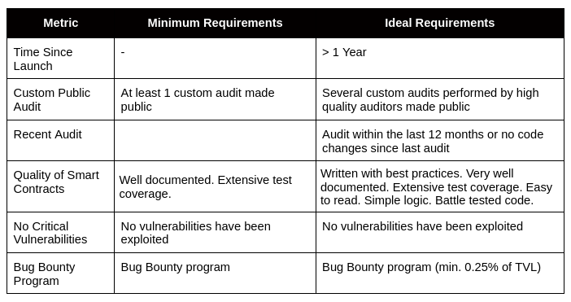
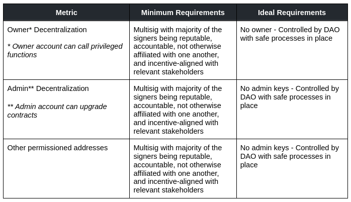
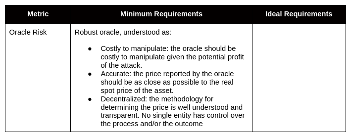
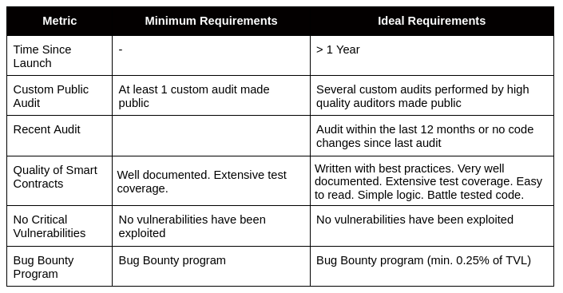
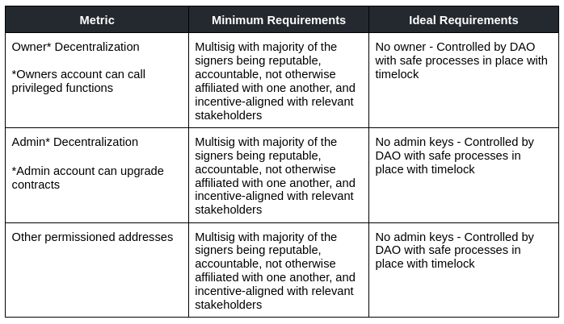
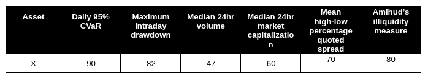
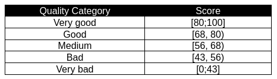
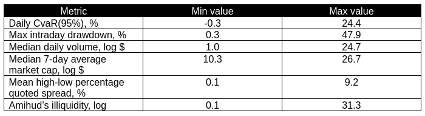
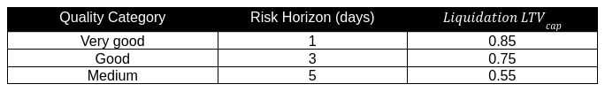
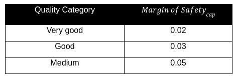

# Mars Risk Framework <!-- omit in toc -->

- [Introduction](#introduction)
- [1. DeFi Protocol and Assets Whitelisting Process](#1-defi-protocol-and-assets-whitelisting-process)
  - [Integrating a certain protocol](#integrating-a-certain-protocol)
  - [Enabling assets as collateral and/or for other interactions](#enabling-assets-as-collateral-andor-for-other-interactions)
- [2. Single Assets Scoring Methodology](#2-single-assets-scoring-methodology)
  - [Risk Metrics](#risk-metrics)
  - [Input Data](#input-data)
  - [Scoring Methodology](#scoring-methodology)
- [3. Risk Parameters](#3-risk-parameters)
  - [3.1 Definitions](#31-definitions)
  - [3.2 Liquidation LTV for Single Asset Tokens](#32-liquidation-ltv-for-single-asset-tokens)
    - [Market Risk Component](#market-risk-component)
    - [Liquidity Risk Component](#liquidity-risk-component)
  - [3.3 Maximum LTV and Margin of Safety for Single Asset Tokens](#33-maximum-ltv-and-margin-of-safety-for-single-asset-tokens)
  - [3.4 Risk Parameters for LP tokens](#34-risk-parameters-for-lp-tokens)
- [4. Model Usage, Monitoring and Update](#4-model-usage-monitoring-and-update)
- [5. Disclaimers](#5-disclaimers)
- [Appendix A. Description of risk metrics](#appendix-a-description-of-risk-metrics)
  - [Amihud’s illiquidity measure](#amihuds-illiquidity-measure)
  - [High-low percentage quoted spread](#high-low-percentage-quoted-spread)
  
## Introduction

This document describes a proposed risk framework for Mars, which serves two main purposes:
1. To qualitatively assess the riskiness of protocols and assets to be added to the platform (including the Red Bank and Mars credit accounts).
   
2. To determine the risk parameters for assets to be added to Mars. Initially, this framework will cover two types of assets: single asset tokens and LP tokens.

The proposed framework enables different assets and LP tokens to be objectively compared and assessed by standardizing how risk is measured and parameters are determined. This framework will be explored in detail in the following sections. The first section will explore the qualitative assessment process to whitelist protocols and assets to be used in the Red Bank or through Mars credit accounts. The second section will describe the quantitative process to assess the riskiness of single assets. Finally, in the last section the methodology to determine the risk parameters for single assets and LP tokens is covered.

The Mars Risk Framework is intended to be a non-binding resource to guide deliberation by Mars governance. The ultimate decision of whether to whitelist a protocol or asset rests solely in the hands of the Martian Council.

## 1. DeFi Protocol and Assets Whitelisting Process

The following criteria are suggested as an initial filter for whitelisting protocols and single assets within Mars. Assets or protocols that don’t meet the minimum requirements described below should not be incorporated into the protocol.

### Integrating a certain protocol

**Technical risk:**

**Centralization risk:**

*Note: assets and protocols controlled by unaccountable, affiliated, and/or centralized entities should not be accepted into Mars.*

### Enabling assets as collateral and/or for other interactions

**Oracle risk:**

*Note: given the oracle's critical importance for the platform, assets without robust oracles should not be accepted into Mars.*

**Technical risk:**

**Centralization risk:**

*Note: for bridged assets, both the bridge itself and the token should pass the minimum requirements. For LP tokens, both the DEX and the token should pass the minimum requirements. This applies to the technical and centralization risk requirements.*

## 2. Single Assets Scoring Methodology

For whitelisted assets, market and liquidity risks are assessed to calculate an asset’s score, which is then used as part of the process to determine the asset’s risk parameters. In this section, we will explore how that score is calculated and how it is used within the overall risk parameters methodology.

### Risk Metrics

The scoring methodology evaluates assets in two broad categories: market risk and liquidity risk. Market risk is related to the volatility of the asset and extreme changes in its price, whereas liquidity risk is related to the ability to liquidate the asset. Specifically, assets are scored using the following metrics:

- **Daily 95% Conditional Value-at-Risk (CVaR, 365-days):** an average of the “extreme” losses in the tail of the distribution of asset returns beyond the value at risk (VaR) cutoff point defined over the past 365 days.
- **Maximum intraday drawdown (90-day):** maximum price change (from high to low) in a trading day over the last 90 days.
- **Median 24hr volume (365-day, logarithm):** median 24hr volume over the last 365 days. 
- **Median 24hr market capitalization (7-day average, 90-days, logarithm):** median 7-day average 24hr market capitalization over the last 90 days.
- **Average high-low percent quoted spread (30-day):** daily bid-ask spread proxy (see Appendix A for details).
- **Amihud’s illiquidity measure (90-day, logarithm):** daily cost-per-dollar-volume proxy (see Appendix A for details).

The following subsections describe the methodology used to score tokens in each of these metrics.

### Input Data

The input data for the scoring methodology corresponds to the daily historical data of asset prices, trading volume, and market capitalization over the past year (365 calendar days) from the reference date. In addition, daily high-low-open-close data is used over the past 30 calendar days and +-2% depth as of the reference date. All data is sourced from Coingecko. Coingecko was used for practical reasons and this should not imply an affiliation or endorsement of the brand.

The selection of the assets for the scoring methodology is as follows: 

1. The list of available assets is sourced from Coingecko. 
2. The top 1,000 assets by market capitalization are selected. 
3. All assets that do not have a trading history of at least 90 calendar days prior to the reference date are removed from the set. 

### Scoring Methodology

The scoring methodology consists of three steps:

1. A score is determined for each risk metric separately. 
2. Aggregation is performed by using simple averaging of scores.
3. Lastly, the final asset’s score is used to define the asset’s quality category.

Let’s explore each step below.

**Step 1. Defining a score for an individual metric**

Firstly, all metrics for each asset are transformed into a score from 0 to 100 to standardize the scoring methodology and compare different assets more efficiently. For this transformation (from metric to 0-100 score), a linear scaling method (min-max normalization) is used. The normalized values represent individual metric scores assigned to each asset. The detailed procedure is the following:

Let $p_{ij}, 𝑖 ∈ [𝑀], 𝑗 ∈ [𝑁]$ denote the initial value of the $j-th$ metric of the $i-th$ asset, $b_{ij}$ is a normalized value of $p_{ij}; p_{min,j}, p_{max,j}$ are the minimum and the maximum values of the $j-th$ metric over all assets.

For positive metrics (i.e., those that increase with improving asset quality), the normalization is performed as follows:

$$ b_{ij} = { p_{ij}-p_{min,j} \over p_{max,j}- p_{min,j} } * 100,i ∈ [M], j ∈ [N] $$

whereas if a metric increase has a negative effect on the final rating the formula becomes

$$ b_{ij} = { p_{max,j} - p_{ij} \over p_{max,j} -p_{min,j} } * 100,i ∈ [M], j ∈ [N] $$

Using (1) and (2) each ith asset is described by a vector of normalized parameters

$$ b_{i} = (b_{i1},…,b_{iN})^T, i∈[M] $$

As a result of this step, the values of all metrics are brought to the same scale in such a way that all metrics positively impact the asset quality (the closer the score to 100 the better the asset quality in regards to that metric).

**Step 2. Aggregation of metrics**

Once scores for all metrics are calculated, they are averaged to get the asset’s final score.

*Example:*

Let asset X have the following scores:

Then the total score is:

$$ Final Score = { 90+82+47+60+70+80 \over 6 } = 71.5 $$ 

**Step 3. Binning**

The range of final score values is divided into sub-ranges to provide five quality categories: “very good”; “good”; “medium”; “bad”; “very bad”. The following binning procedure is applied to define the category intervals.

The upper expectation (ceiling) for the final score is set to be 80, and the lower expectation (floor) is the 10th percentile of the distribution of score values. Assets with a final score above the ceiling are assigned a category “very good.” while those with a final score below the floor are assigned a category “very bad.”

The intervals between ceiling and floor are defined based on the equal width binning procedure. The width of each interval is:

$$ ∆ = { ceiling - floor \over k} $$

where $k$ equals $N-2$, $N –$ is the number of categories. The corresponding interval boundaries are:

$$ floor+∆,floor+2∆,…,floor+(k-1)∆ $$

Each asset is assigned a quality category depending on the interval in which the value of the final score falls, according to the following table:

*
Table 1. Bins for quality categories
*

These categories are used to define the maximum allowable LTVs within each category and risk horizons for the LTV calculation methodology (see Section 3).

The procedure for determining the final score is similar for new assets (not included in the initial data sample). Firstly, all metrics are calculated based on historical data and normalized using the minimum and maximum values previously defined from the sample (see the table 2 below). If the metric value exceeds the maximum or below the minimum, it is assumed to be equal to the maximum or minimum value, respectively. Finally, the obtained scores are averaged to get the total score.

*
Table 2. Min and max values used for metrics normalization
*

## 3. Risk Parameters

This section describes the approach to determine the risk parameters for whitelisted assets and LP tokens, namely Liquidation LTV, Maximum LTV, and Margin of Safety.

### 3.1 Definitions

- **Liquidation LTV** is the LTV at which a position is defined as undercollateralized and the user becomes liquidatable.  
- **Maximum LTV** (≤ Liquidation LTV) is the maximum LTV allowed when the user is opening or adjusting a position. 
- **Margin of Safety** is the difference between the Liquidation LTV and Max. LTV. It’s a safety cushion to avoid users becoming liquidatable immediately after opening a position at the maximum allowed LTV.

The derivation of Liquidation LTV is described in Section 3.2. The approach to define Margin of Safety and corresponding Maximum LTV is provided in Section 3.3. Lastly, in Section 3.4 the methodology to determine these risk parameters for LP tokens is explored.

### 3.2 Liquidation LTV for Single Asset Tokens

Liquidation LTV is defined for each token as follows:

$$ Liq.LTV = min⁡(LTVestimated,LTVcap) $$ 

where

$$ LTVestimated=1-Haircut $$

$$ Haircut=Market Risk Component+Liquidity Risk Component $$

$$ Market Risk Component≥0, Liquidity Risk Component≥0 $$

The haircut intends to capture the percentage potential loss of value of a given asset after it becomes liquidatable due to the following factors:

- Market risk component – risk related to possible extreme price movements.
- Liquidity risk component – the cost of liquidating a position following a liquidation event due to the impact of the liquidation on the market price.

A detailed description of the calculation approach for both components is given in the following subsections. The greater the asset's market and/or liquidity risk, the higher the corresponding haircut and the lower the LTV.

The $LTV_{cap}$  serves to limit the LTV obtained from the historical data to ensure conservatism and depends on the token’s quality as defined in Section 2 (see table 3 below).

#### Market Risk Component

The market risk component is an LTV adjustment defined such that the expected likelihood* of the price of the asset dropping more than the market risk component is 1%. Hence the market risk component is defined as the 99% conditional value-at-risk with a given risk horizon (average of the “extreme” returns in the left tail of the asset returns distribution, beyond the value at risk cutoff point):

$$ Market Risk Component= -CVaR(99\%, Risk Horizon) $$

where $CVaR(99\%, Risk Horizon) ≤ 0$ is defined by using the historical-simulation approach, which implies that the probability distribution and corresponding tail-risk are estimated empirically from the observed price movements (percentage asset returns) over the past 365 days from the reference date. 

*It’s important to highlight that this methodology only provides an estimate of extreme future price trajectories of a given asset. This estimate is based on past price performance and, as such, it should be understood as a backward-looking, fallible (though valuable) tool for predicting future prices.*

The risk horizon represents the longest period required for a position to be liquidated. It is assumed to depend on the asset category (see table 3 below) and varies from 1 to 5 days. The riskier the asset, the longer the period used to calculate relative price movements and quantify corresponding tail-risk (CVaR). Usually, liquidations within DeFi happen within 1 day. However, the minimum 1-day horizon is used to ensure conservatism as the historical simulation approach is backward-looking and may not cover all potential movements of the asset price in the future. 

Note: estimating the distribution quantile can be inaccurate for assets with short histories. To take this into account, we use quantiles for those pairs where we have price histories over the past 200-365 days, while for others (90-200 days history), we use the extreme move approach - maximum observed percentage returns over the available historical period.

#### Liquidity Risk Component

The liquidity risk adjustment is defined per asset using the -2% dollar depth aggregated over different exchanges as of the reference date. It is a cost-per-dollar-volume liquidity risk measure that is interpreted as capital in USD required to move the price by 2% down from the last traded price. The list of exchanges considered includes Uniswap, Osmosis, and top-10 exchanges according to the Coingecko ranking. 

The liquidity risk component is calculated for each token as follows:

$$ Liquidity Risk Component  = Swap Size \ \$ * { 0.02 \over Depth_{-2\%} \$ } $$

Here the multiplier 0.02/($Depth_{-2\%}$$) shows how much % the price will move down subject to $1 volume. 

Depth refers to the ability of the market to absorb the sale or exit of a position. A liquidator who liquidates a position of an ordinary user is not likely to impact the asset price. Selling a large block of assets though, can cause the price to fall when the asset is sold. Hence, the Swap Size is set to depend on the asset's deposit cap and is defined conservatively, assuming a medium-size transaction amount that can have a notable impact on the asset price as 1% of the deposit cap.

The risk horizon and $LTV_{cap}$ for each token’s category are provided in the table below:

*
Table 3. Risk horizons and LTV caps per asset’s quality category
*

### 3.3 Maximum LTV and Margin of Safety for Single Asset Tokens

The Liquidation LTV is defined based on the $CVaR(99\%, horizon)$ with the horizon determined by the token’s quality category. The safety margin is defined as the absolute difference between the CVaR calculated at the defined horizon plus 1 day and the $CVaR(99\%, horizon)$:

$$ Margin \ of \ Safety= -(CVaR(99\%, horizon+1)-CVaR(99\%, horizon)) $$

Thus, the margin of safety is defined by the relative price drop incurred in one additional day in relation to the horizon used to determine the Liquidation LTV.

The higher the price volatility of the token, the more the price can fall with an increase in the risk horizon by 1 day, and therefore the higher the safety margin and the lower the corresponding Maximum LTV will be.

The following caps are applied to the margin of safety derived from the historical data depending on the token’s quality category:

*
Table 4. Margin of Safety caps per token’s quality category
*

The minimum margin of safety is set to be 0.005.

The Maximum LTV is defined based on an absolute adjustment applied to the Liquidation LTV as follows:

$$ Max.LTV= Liq.LTV-Margin \ of \ Safety $$

### 3.4 Risk Parameters for LP tokens

The Liquidation LTV of LP tokens is calculated as the average of the Liquidation LTVs of the individual assets that compose the LP token, adjusted for IL risks:

$$ Liq. LTV \ for \ LP \ token = Avg(Liq. LTV_{1},Liq. LTV_{2}) * IL \ Risk \ Adjustment $$

where $Liq.LTV_{1}, Liq.LTV_{2}$ are the Liquidation LTVs of the assets that compose the LP token (assuming a 50/50 LP token). The IL Risk Adjustment ≤ 1 is intended to capture the additional impermanent loss risks associated with holding an LP token (vs. a 50/50 portfolio of the individual assets).

The IL risk is defined as follows: 

$$ IL \ Risk \ Adjustment = 1 + Expected \ IL $$

where Expected $IL ≤ 0$.

Assuming a 50%/50% LP token and constant product AMM, IL is calculated as follows: 

$$ IL = 2 { \sqrt{R} \over R+1 } + 1 $$ 

where $R = { P_{1} \over P_{0} } = { 1 + r^x_{1} \over 1 + r^y_{1} }$, $r^x_{1}$ and $r^y_{1}$ are simple assets’ returns calculated over the unit of time and Pi is the pool price. *Note that the above IL formula excludes trading fees and other rewards LP token holders may accrue. This is intentional and is done to calculate a worse-case IL, which ultimately generates a more conservative LTV for the LP token.*

From (11), historical ILs for each pool are calculated by using the 10-day overlapping asset returns over the past 365 days. 

Then the expected IL is estimated by using the historical simulation value-at-risk approach. Based on the empirical distribution of ILs, value-at-risk measures the loss value that will not be exceeded with a probability of 95% over a 10-day risk horizon:

$$ IL \ Risk \ Adjustment = 1+VaR_{95\%,10-day}(IL distribution) $$

The risk horizon represents the longest period needed for liquidation (the longest period over which the protocol can be exposed to the position, i.e., liquidating the LP token).

The risk horizon is set to 10-days to ensure conservatism.

*Note: Estimating the distribution quantile can be inaccurate for assets with short histories. To take this into account, we use quantiles for those pairs where we have price history over the past 200-365 days, while for others (90-200 days history), we use the extreme move approach - maximum observed ILs over the available historical period.*

The applied IL risk adjustment allows to capture the size of the loss (risk exposure) within the chosen risk horizon and the associated probability level (the likelihood of a loss of a given magnitude (with a 5% chance of exceeding it)). Using a historical simulation method to estimate value-at-risk captures any empirical dependencies (including non-linear ones) between the two assets in the pool.

The Margin of Safety and the Maximum LTV for LP token are defined as follows:

$$ Margin \ of \ Safety \ for \ LP \ token = Avg(Margin \ of \ Safety_{1},Margin \ of \ Safety_{2}) $$

$$ Max. \ LTV \ for \ LP \ token = Liq. \ LTV \ for \ LP token - Margin \ of \ Safety \ for \ LP \ token $$

where $Margin \ of \ Safety_{1},Margin \ of \ Safety_{2}$ are the Margins of Safety of the assets that compose the LP token.

## 4. Model Usage, Monitoring and Update

Approaches used in this framework to define risk parameters are primarily data-driven; hence the obtained risk parameters are expected to change in response to varying market conditions. Therefore, obtained LTVs can be revised regularly (i.e. once every six months or urgently in case of severe market stress) to avoid stale risk parameters.

When updating the model, the historical data period can also be revised to ensure that the sample covers at least one period of acute stress (e.g., May 2022).

Additionally, the sanity of the final outputs of the model should be checked by the community such that final parameter adjustments are made when considered necessary.

## 5. Disclaimers
Please Note: The proposed risk framework is not intended as financial advice and should not be relied upon; rather, it is being made available for educational purposes as a starting point for each person’s own independent review and analysis of risks. The risk framework could fail to account for certain risks or could fail to adequately weigh the risks that it does account for. Use at your own risk. No representation, warranty, guaranty, indemnity or assumption of risk is being provided hereby. This article is subject to and qualified by the Mars Disclaimers/Disclosures.

## Appendix A. Description of risk metrics

### Amihud’s illiquidity measure

The metric is calculated as follows:

$$ illiq = { 1 \over n} \sum^n_{i = 1} { |R_{i}| \over V_{i} } $$

where $R_{i}$ is the daily asset return at day $i$ and $V_{i}$ is the daily dollar trading volume at $i$.

In cases where significant price changes with small trading volume exist, this ratio increases, which means that the illiquidity of the stock increases. Everything else being equal, a higher trading volume will lead to a lower Amihud illiquidity measure.

This metric is considered a proxy for market depth liquidity measure.

### High-low percentage quoted spread

The metric is calculated as follows:

$$ Spread = { 1 \over 2} * { P_{high} - P_{low} \over P_{mid} } $$

where $P_{high}$ is the highest daily price, $P_{low}$ is the lowest daily price, $P_{mid}$ is the mid-price. The full spread $P_{high}-P_{low}$ represents the cost of buying and selling the asset today. As we are only interested in the cost of selling, the cost of liquidity is only half of the spread.

This metric represents a proxy for the bid-ask spread, widely used as a market width measure.
