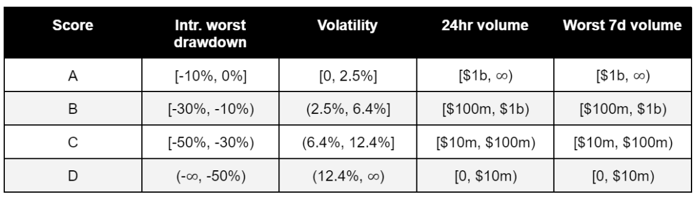
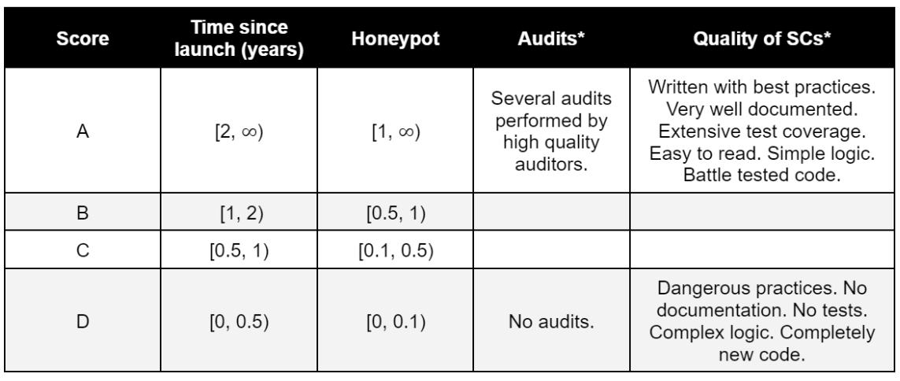
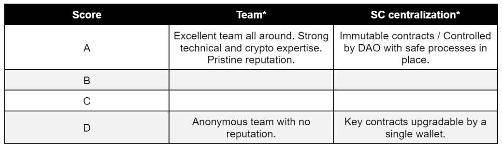
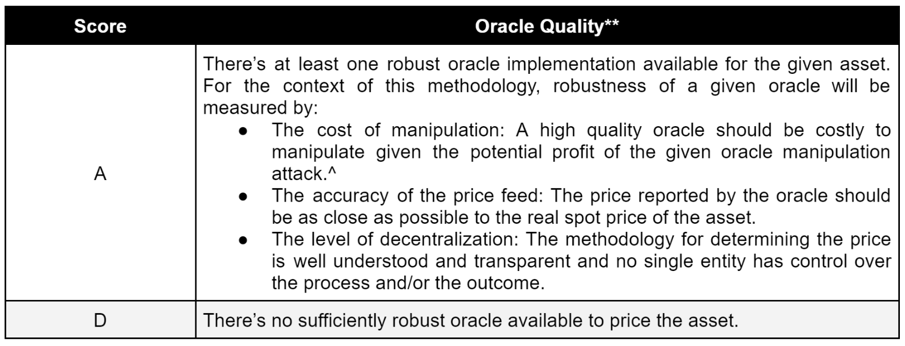
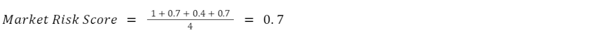
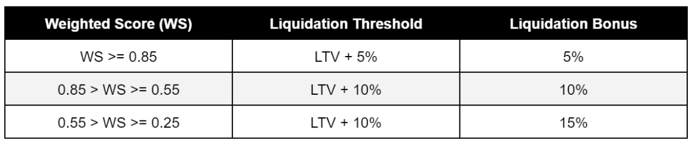
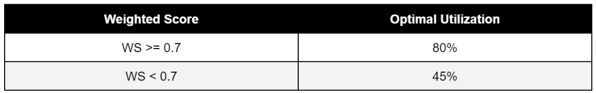
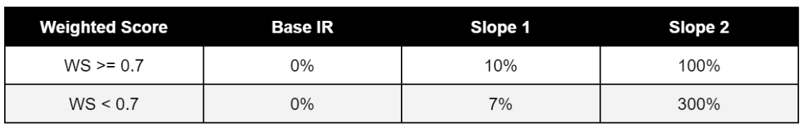
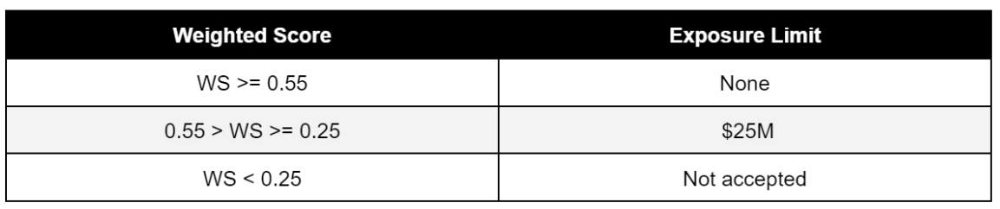

# The Red Bank Asset Listing Risk Framework
The Mars Risk Framework serves two main purposes: 1) Assessing the riskiness of assets to be added to the platform and 2) based on that assessment, setting the risk parameters for those assets. This section describes the Risk Framework in detail. The first section defines certain categories and variables that can be used to assess the riskiness of an asset. The second section describes a methodology for scoring these assets. The last section describes a potential process to set the protocol’s risk parameters.

## Risk categories and measured variables

The Risk Framework evaluates assets in 4 main categories:
* Market Risk: Measures the liquidity and volatility of the asset. 
* Smart Contract (SC) Risk: Measures the riskiness of the asset at the technical layer. 
* Centralization (CP) Risk: Measures the centralization risk of the asset. 
* Oracle Risk: Measures the risks associated with the oracles used to price assets within the protocol.

Each of these categories, in turn, is measured through the following variables:

**Market Risk:**
* Maximum intraday drawdown: Maximum price change (from high to low) in a trading day over the last 365 days. 
* Volatility: Standard deviation of the logarithmic daily returns over the last 90 days. 
* 24hr volume: Average 24hr volume over the last 90 days. 
* Worst 7-day volume: Minimum 7-day average 24hr volume over the last 90 days.

**Smart Contract Risk:**
* Time since launch. 
* Honey pot: Daily sum of the project’s Total Value Locked (TVL) since launch. For standardization purposes, this value is divided by $365B ($1B per day for 365 days) to arrive at the Honey Pot coefficient. 
* Audit quality (Qualitative): Thoroughness and quality of audits performed on the project. 
* Quality of smart contracts (Qualitative): Measures the overall riskiness of the smart contracts. Evaluates the use of best practices, the thoroughness of the tests and the documentation, among other factors.

**Centralization Risk:**
* Team (Qualitative): Evaluates the reputation and integrity of the team behind the project. 
* Key contracts centralization (Qualitative): Measures the level of centralization of the most important contracts of the protocol.

** Oracle Risk:**
* Evaluates the level of decentralization and robustness of the oracle implementation to be used to price a given asset within Mars.

## Scoring Methodology

Each asset will receive a score from A to D in the relevant variables for each category according to the following tables:

**Market Risk:**

**Smart Contract Risk:**

**Centralization Risk:**

**Oracle Risk:**

_^See an example of profit/cost estimation research [here](https://members.delphidigital.io/reports/attack-cost-and-profit-from-manipulating-constant-product-market-maker-twap-oracles-in-defi-protocols/)_

_*Since there’s more subjectivity involved in assessing these qualitative variables, only the conditions for the highest (A) and lowest (D) scores are defined. Anything in between will be scored on a case by case basis according to the asset’s positioning between these two points._

_** In contrast to the other qualitative variables, the Oracle implementation can only be scored either A or D. Given the critical importance of this element within the Mars architecture, the scoring methodology should be more binary: either the available oracle is secure enough or it isn’t._

After determining the score for each variable within each category, a final numeric score per category is computed. This score will be the average score of each of the category’s variables, according to the following table:

## Example 1: Market Risk Score Calculation
Let Asset A have the following scores for the Market Risk variables:
* Intraday worst drawdown: A 
* Volatility: B 
* 24hr volume: C 
* Worst 7d volume: B

Then, the final numeric score for this asset would be:

## Risk Parameters
Before defining the risk parameters methodology, it’s worth exploring what the risk parameters are:

**Loan-to-Value (LTV):** Determines the maximum amount a user can borrow with a certain collateral. For example, if the LTV of an asset is 50%, a user who deposits 1,000 UST worth of that asset will be able to borrow up to 500 UST worth of any asset available on the platform. Given that a user can deposit multiple assets as collateral, the total LTV for a user can be calculated as follows:

**Liquidation Threshold:** Determines the level at which a loan is considered to be undercollateralized and can be liquidated. For example, if the Liquidation Threshold of a position is 70% and the value of the borrowed assets for that position increases to over 70% of the value of the collateral, the position can be liquidated. The liquidation threshold will always be higher than the LTV for every asset. This serves as a margin of safety for borrowers. The Liquidation Threshold per user can be calculated as follows:

**Liquidation Bonus:** Determines the bonus the liquidator receives when it liquidates a position. This bonus is paid from the collateral of the user that gets liquidated. For example, if the liquidation bonus is 15%, liquidators receive an additional 15% of the borrower’s collateral for every unit of debt repaid.

**Optimal utilization:** Determines the optimal ratio of borrowed vs. deposited assets for a given money market. For example, if the optimal utilization of a market is 80%, then at the optimal utilization level the amount of assets borrowed from that market should be 80% of the assets deposited into that market.

**Interest Rate (IR) Parameters:** The relevant parameters that define the behavior of the interest rate for the given asset. The specific parameters depend on the model used, as follows:

* 2-Slope Model Parameters (if using the 2-slope interest rate model):
 * Base Interest Rate: Interest rate when utilization is 0%. 
 * Slope 1: Defines the slope of the interest rate line when utilization is lower than the optimal utilization. 
 * Slope 2: Defines the slope of the interest rate line whenever the utilization is greater or equal to the optimal utilization.

 * Kp - Controller Proportional Term (if using the PID controller-based dynamic interest rate model): Defines how quickly the interest rate reacts to changes in utilization. This parameter varies from market to market depending on two main factors - the overall risk rating and the responsiveness of the asset. Two values of Kp need to be defined: Kp1 for normal conditions and Kp2 to be used in extreme conditions. Normal conditions refer to situations where utilization is within a 20 percentage point range from the optimal utilization. In situations where that’s not the case, Kp2 will be used such that interest rates adjust more aggressively.

**Exposure Limit:** Mars will set a deposit limit to certain assets based on their risk profile. This cap will serve as a protection mechanism that allows newer (and potentially riskier) assets to be added to the platform without sacrificing the overall integrity of the system.

**Collateral (Binary):** Indicates whether an asset can be used as collateral within the platform. Some assets that fall into a specific risk profile may be allowed to be deposited in the platform and made available for borrowing, but they wouldn’t be usable as collateral.

As was mentioned before, the scoring methodology explored in the previous section is the most important input for determining the risk parameters per asset. While all categories are relevant to determine every risk parameter, different weights are used for each category depending on the parameter.
For liquidation-related parameters (LTV, Liquidation Threshold and Liquidation Bonus), for instance, Market Risk weighs more heavily; once an asset is included in the platform, most of the liquidation risk comes from challenging market conditions, which are incorporated into the Market Risk category. SC and CP risk, on the other hand, are risks that can materialize in a more binary way. As such, they have more importance when determining the Exposure Limit and the Collateral, as those parameters limit the overall exposure of the platform to a certain asset in a more direct way.
The specific details of how each of these parameters is set will be explored in detail in the following sections.

## Oracle
Given the oracle’s critical importance for the robustness of the platform, assets with an Oracle Risk score of D won’t be accepted into Mars.

## LTV, Liquidation Threshold and Liquidation Bonus
These parameters will be determined as follows:
First, the LTV is computed:
LTV = Max. LTV * Weighted Score, where:
Max. LTV = 90%, which indicates the maximum LTV given to A assets in the platform.
Weighted Score = 0.7 (Market Risk Score) + 0.15 (SC Risk Score) + 0.15 (CP Risk)
Then, the Liquidation Threshold and Liquidation Bonus are calculated as follows:

Any asset with a Weighted Score below 0.25 won’t be included in the platform.

## Optimal Utilization

Based on the same Weighted Score used in the previous section, the initial optimal utilization values will be determined as follows:

Given that the optimal utilization is a critical parameter for the interest rate model, real utilization will be closely monitored once markets are live and optimal utilization will be updated accordingly in cases where it’s needed.

## Interest Rate Parameters

2-Slope Model Parameters (if using the 2-slope interest rate model):

Using the same Weighted Score as in the previous section, the interest rate parameters will be determined as follows:

Kp - Controller Proportional Term (if using the PID controller-based dynamic interest rate model):
The main criteria to set Kp1 and Kp2 is the responsiveness of the market to changes in the interest rate. The lower the responsiveness, the lower the Kp in order to avoid drastic changes in interest rates within those markets and vice versa. To determine the responsiveness of each asset, a qualitative assessment was performed to estimate demand for that asset within the protocol. The initial set of parameters will be set on the conservative side. Once enough empirical data is available, a quantitative methodology will be developed to complement this qualitative approach.

## Exposure Limit

The exposure limit will be determined as follows:
First, a Weighted Score is calculated.
Weighted Score = 0.2 (Market Risk Score) + 0.4 (SC Risk Score) + 0.4 (CP Risk)
After calculating the Weighted Score, the exposure limit is determined according to the following table:

Note: The exposure limit will need to be implemented via governance.
## Collateral (Binary)

Not every asset accepted on Mars will be available for use as collateral. Specifically, assets with high centralization risk (D score in both CP variables) won’t be accepted as collateral.

_Note: The proposed risk framework is not intended as financial advice and should not be relied upon; rather, it is being made available for educational purposes as a starting point for each person’s own independent review and analysis of risks. The risk framework could fail to account for certain risks or could fail to adequately weigh the risks that it does account for. Use at your own risk. No representation, warranty, guaranty, indemnity or assumption of risk is being provided hereby. See also the [Mars Disclaimers/Disclosures](https://mars-protocol.medium.com/mars-disclaimers-disclosures-f44cc7c54a33)._

Content on this page should be migrated to GitHub with the title Red Bank Asset Listing Risk Framework: [https://docs.marsprotocol.io/mars-protocol/protocol/welcome-to-mars/red-bank-risk-framework](https://docs.marsprotocol.io/mars-protocol/protocol/welcome-to-mars/red-bank-risk-framework)

Desired destination link: [https://github.com/mars-protocol/mips/Red-Bank-Asset-Listing-Framework.md](https://github.com/mars-protocol/mips/Credit-Line-Extension-MIP-Template.md)